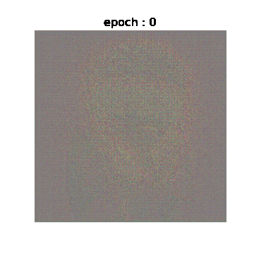
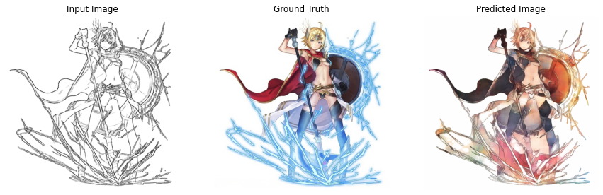

# Auto-Painter

- [Auto-painter: Cartoon Image Generation from Sketch by Using Conditional Generative Adversarial Networks](https://arxiv.org/abs/1705.01908)

## Demo

## Timeline

- 2021-04-15 : 프로젝트 시작
- 2021-04-18 : 모델 구현 완료 및 학습 시작
- 2021-05-11 : 300epochs 학습 완료
- 2021-05-14 : 서비스 구현 완료
- 2021-05-16 : Ainize로 배포 완료

## Abstract

최근에, DNN을 사용한 사실적인 이미지 생성은 머신러닝과 컴퓨터 비전 분야에서 화제가 되고 있다. 대량의 이미지를 학습함으로써 이미지는 픽셀 수준에서 생성될 수 있다. 흑백 스케치부터 다채로운 만화 이미지를 생성하는 방법을 배우는 것은 흥미로운 연구 주제일 뿐만 아니라, 디지털 엔터테인먼트의 잠재적 활용 분야이기도 하다. 우리는 이 논문에서 cGAN을 이용하여 스케치를 이미지로 합성하는 문제에 대해 조사한다. 우리는 스케치와 호환되는 색상을 자동으로 생성해주는 오토 페인터 모델을 제안한다. 새로운 모델은 손으로 그린 스케치에 적절한 색을 칠해주는 것이 가능할 뿐만 아니라, 사용자가 선호하는 색상을 나타낼 수도 있다. 두 개의 스케치 데이터셋 실험 결과는 오토 페인터가 현존하는 image-to-image 방법보다 더 잘 작동하는 것을 보여준다.

## Related Work

- Generative Adversarial Networks(GANs)
- Conditional GANs
- Image-to-Image

## Method

- Supervised Learning
    - Dataset : sketch-colored pairs image set

### Network Structure

- U-Net
- Discriminator : PatchGAN

### Loss Function

- Generator Loss

,&space;z\sim&space;pdata(z)}[log(1&space;-&space;D(x,&space;G(x,&space;z)))])

- Pixel-level loss

,&space;z&space;\sim&space;pdata(z)}[\parallel{y&space;-&space;G(x,&space;z)}\parallel_1])

- Extracted high-level feature from VGG loss

,&space;z&space;\sim&space;pdata(z)}[\parallel{\phi(y)&space;-&space;\phi&space;G(x,&space;z)}\parallel_2])

- Total variation loss

%5E2%20&plus;%20(y_%7Bi,%20j&plus;1%7D%20-%20y_%7Bi,%20j%7D)%5E2%7D)

- Total Loss Function

## Experimental Studies

- Dataset
    - 512x512 pixel Japanimation about 20000 pictures

## Result
- Epoch에 따른 학습 과정 시각화

- 300 Epoch 학습 

## Todo-list

- [x]  index templates 수정
    - [x]  샘플 이미지 수정
    - [x]  Input image size 수정
- [x]  AWS or GCP 이용하여 배포 -> 무료 티어에서 불가
- [ ]  채색된 이미지 스케치 이미지로 바꾸는 기능 -> Anime2sketch 이용해볼 예정
- [ ]  방문자 카운터
- [ ]  입력 크기 이미지로 출력 -> waifu2x 사용하여 Upscaling? or SRGAN
- [ ]  이미지 URL로 입력 받기

## 문제점들

- sketch와 colored 이미지의 위치가 바뀌는 경우가 있어서 이미지를 불러올 때 position을 argument로 하여 위치를 지정할 수 있게 했었는데 tf.Dataset.map함수를 적용할 때 arguement를 지정할 수 없어서 map 함수에 lambda 식과 tf.py_function 함수를 이용하여 해결하였다.
    - tf.Dataset object에서 데이터를 가져오지 못하는 문제가 발생하여 직접 position을 수정하게 해주었다.
- 논문에선 VGG의 4번째 layer를 이용해 feature를 추출하여 loss를 계산하는데 모델에서 특정 레이어까지의 결과만 가져오는 방법을 모르겠다.
    - 구글링으로 해결
- 논문 저자의 Github에 있는 Demo 프로그램을 실행시켜 직접 확인해봤는데 색 정보를 제공하지 않는 일반 sketch2colored 변환은 생각보다 잘 되지 않았다. 내가 학습중인 모델은 학습 시간이 너무 오래 걸려서 아직 확인해보진 못했지만 아마 비슷할 것으로 예상된다.
- 학습 시간이 1epoch에 30분이나 걸리는 데다가 메모리도 모자라서 연속으로 10epoch 이상 훈련하면 OOM으로 학습이 중단되고, 사용하지 않을 때만 학습중이라서 프로젝트 진행이 늦어지고 있다.
- output 이미지가 중복되지 않게 저장될 수 있도록 datetime함수를 사용하여 파일 이름으로 사용했으나 정상적으로 작동하지 않았다. 그러나 time함수로는 작동하였다.
    - `datetime.datetime.now()` 함수의 `:` 문자가 파일명에 사용될 수 없는 문자이기 때문에 오류가 났었다.
- AWS EC2를 이용해서 모델을 서빙하려고 했는데 무료 티어에서는 tensorflow 설치가 불가하여 서빙이 불가능한 것 같다. 다른 방법을 찾아보고 없다면 Ainize 또는 로컬에서 작동시켜야 할 것 같다.
- AWS 무료 티어에 `tensorflow-cpu` 버전은 설치가 가능하길래 설치 후 실행시켜보았으나 메모리 부족으로 Inference는 불가하였다. 무료 티어에 할당되는 1GB 메모리로는 역시 부족이었다.
- auto-painter를 더 전문적인 서비스로 운영중인 [patalica paint](https://petalica-paint.pixiv.dev/index_en.html) 를 발견하여 테스트를 진행해본 결과, GAN을 이용한 채색은 아직 실제로 사용하기엔 부족한 것 같다. 해당 서비스가 내가 만들어보고자 했던 서비스와 매우 비슷했기 때문에 더 좋은 모델이 나오지 않는 이상은 더 좋은 성능을 기대하긴 어려울 것 같다.
